# SalBarAn: Human-Computer Interaction Final Project

## Creators

Class: L1BC

Group: TheTriHards

Members:
1. 2602158626 - Adyatama Mahabarata
2. 2602158235 - Cristoval Neo Sasono
3. 2602158273 - Alexander Owen

## Table of Contents

- [Project Description](#project-description)
    - [Purpose](#purpose)
    - [Functionality](#functionality)
    - [Design](#design)
    - [Programming Functionality](#programming-language)
    - [Limitations](#limitations)
    - [Future Developments](#future-developments)
    - [Prototype Screenshots](#prototype-screenshots)

## Project Description

## Purpose

The purpose of this prototype is to give users an ease of access to information regarding barbers and salons around them.

## Functionality

With this curent prototype, users are able to:
1. Users are able to register/login with their new account. However, it is still has its [Limitations [No. 1]](#limitations).
2. Users are able to view barbers/salons that have been registered into the app.
3. Users are able view promotional offers by barbers/salons.

## Programming Language

This prototype was built in VSC (Virtual Studio Code) using these programming languages:
1. HTML
2. CSS
3. JS

## Limitations

With this current prototype, there are some limitations in its functionality:
1. User login/register data will be reset upon refreshing or a successful login.
2. Users have yet to be able to contact the SalBarAn team through the 'contact' menu.
3. Users have yet to be able to send a rating to the SalBarAn team through the 'Rate Our Website' menu.
4. Users have yet to be able to search using the search bar.

## Future Developments

If given the opportunity to further this prototype's development, new and current implementations can be worked on/improved further, such as:
1. User account data is stored on a database.
2. Functional search bar.
3. Users will be able to contact the SalBarAn team.
4. Users will be able to send feedback to the SalBarAn team.
5. [Ultimate Goal]: Users are able to book directly through the app.

## Prototype Screenshots 

## Desktop View:

    Create Account  

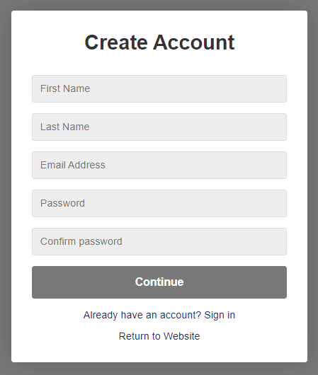 

    Login Account

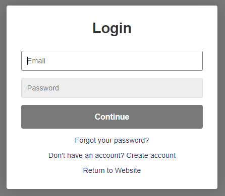

    Home Page

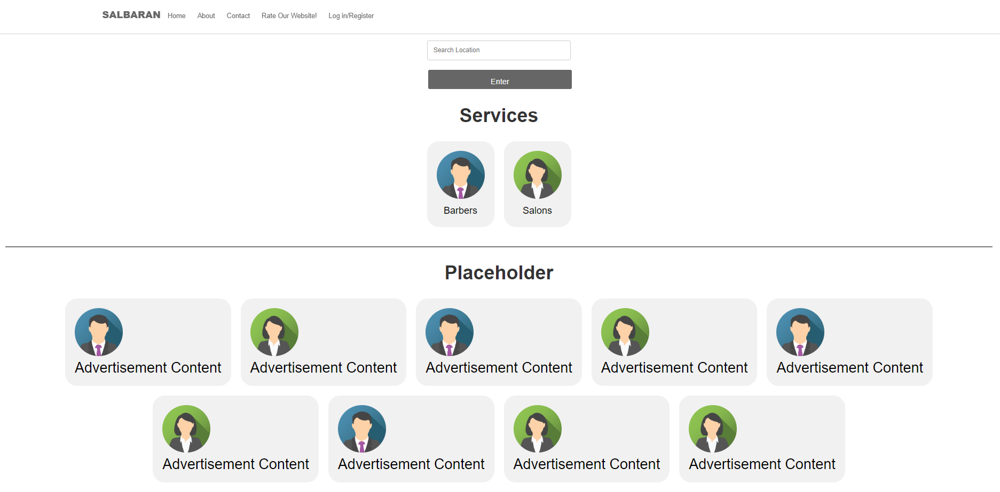

    Contact Us Page

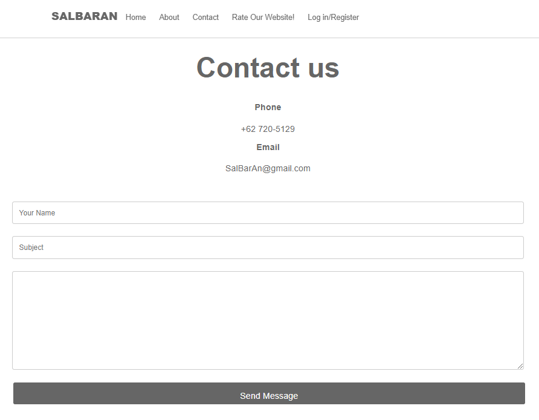

    Rate Our Website Page

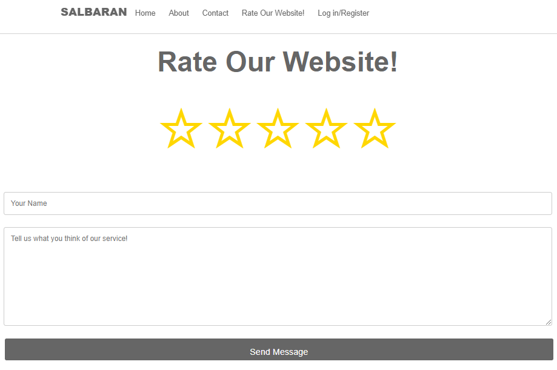

    About Us Page

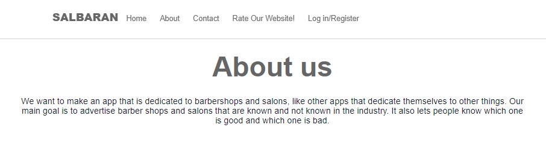

    Barber Places Page

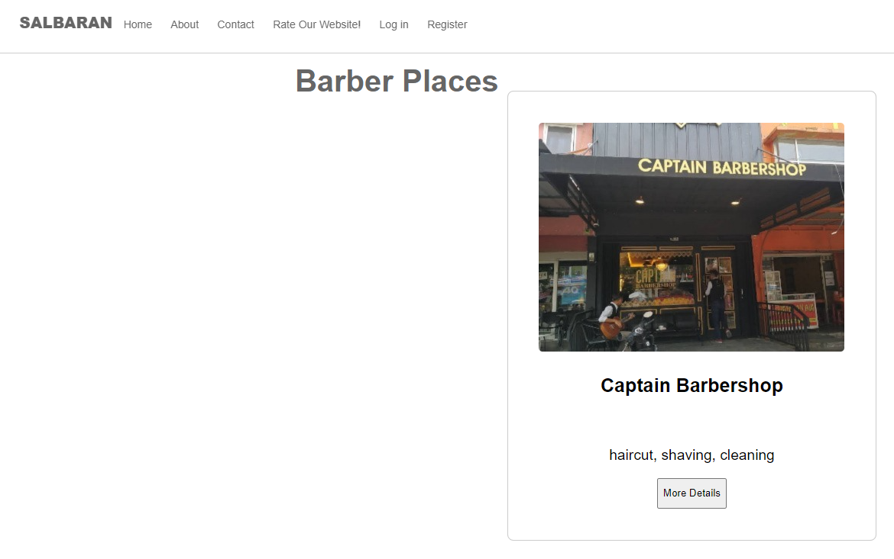

    Barber Places 'More Details'

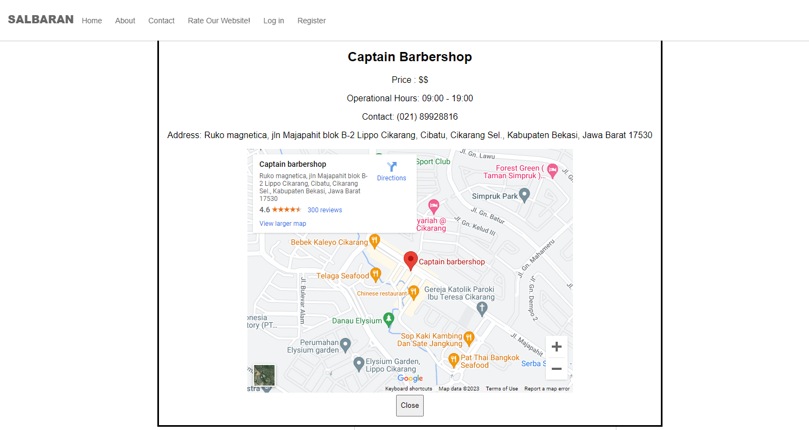

    Salon Places Page

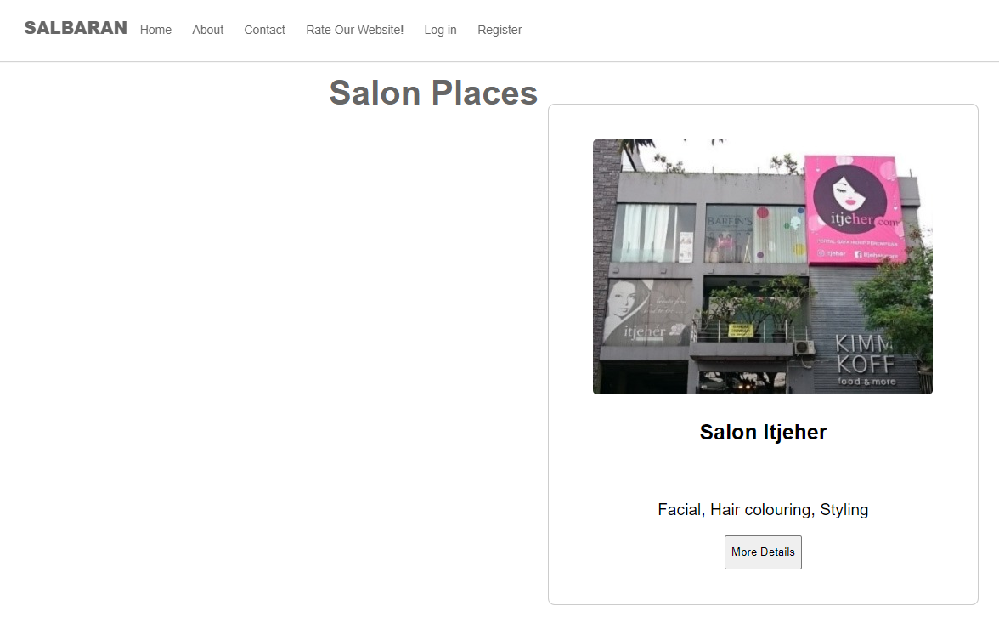

## Mobile View:

    Create Account 

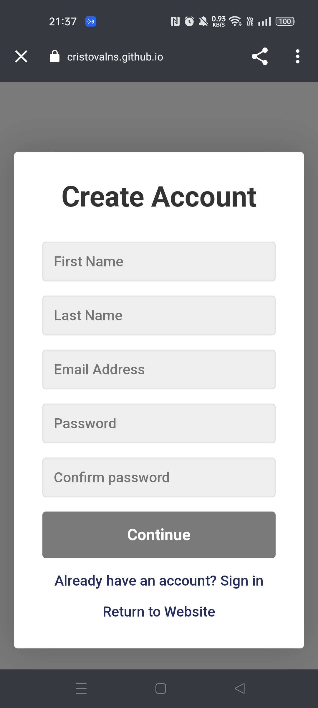

    Login Account 

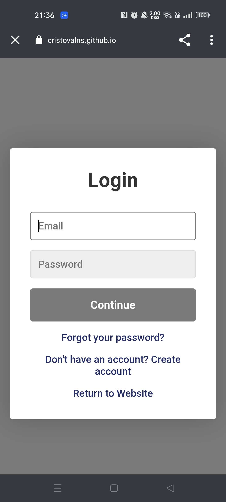

    Home Page

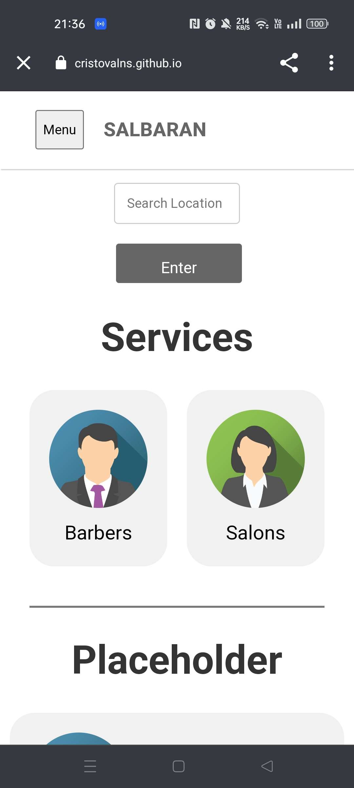
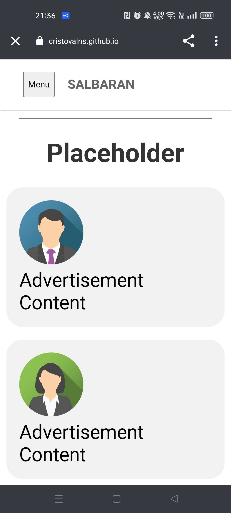
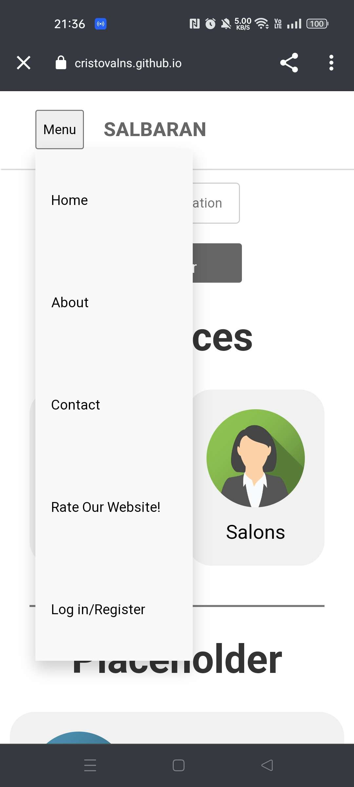

    About Us Page

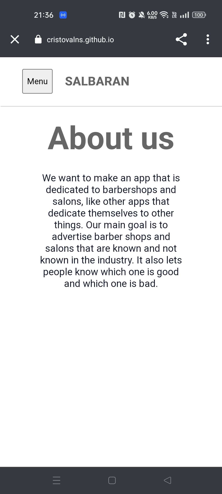

    Contact Us Page

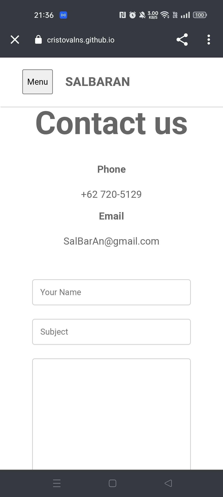

    Rate Our Website Page

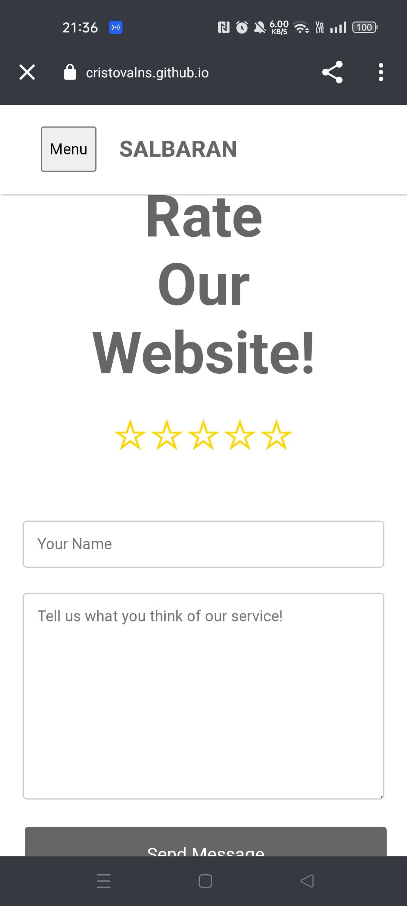

    Barber Places Page

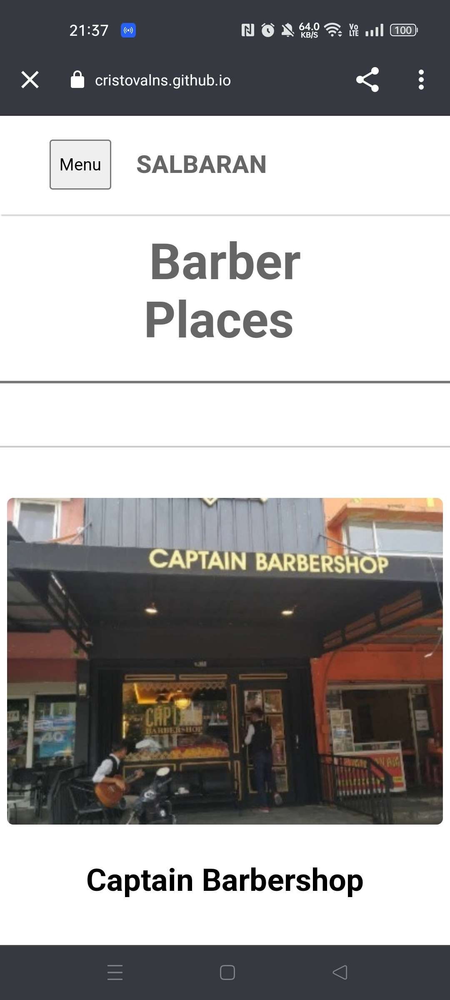

    Barber Places 'More Details'
    
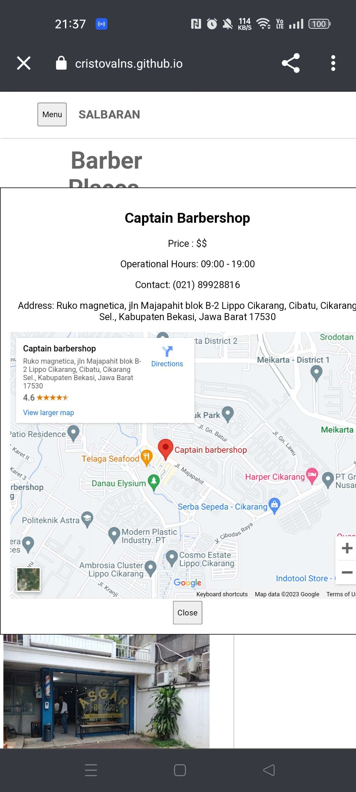

    Salon Places Page

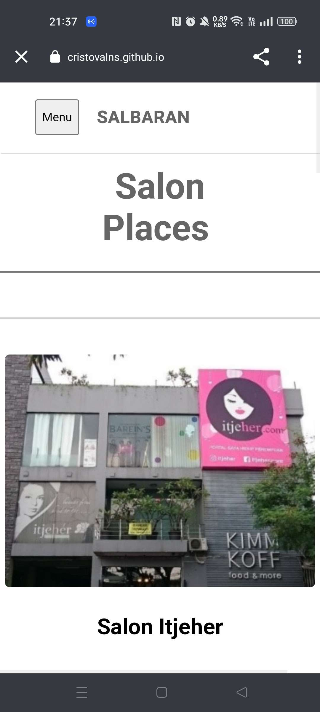
